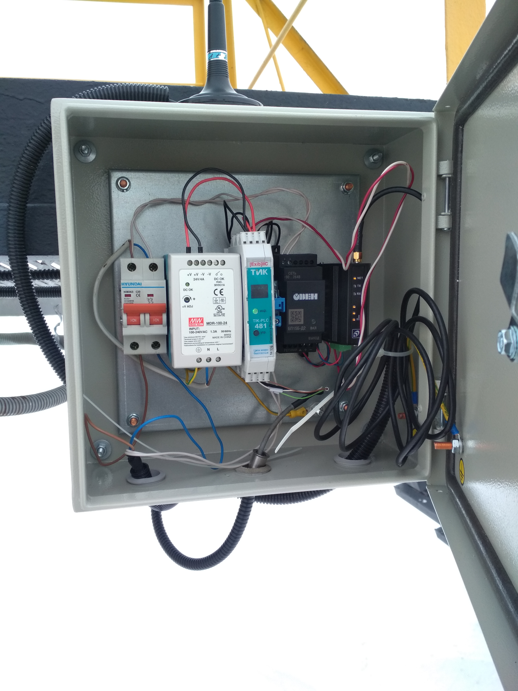

# Программируемый логический контроллер 

Предназначен для регистрации сигналов, поступающих от внешних датчиков с выходом 4...20 мА / двухпроводным выходом по напряжению / цифровым интерфейсом RS-485, их обработки и передачи получаемой информации во внешнюю систему телемеханики и управления;
 
  Выполняет функции ПАЗ, источника питания датчиков и барьера безопасности;

    + канал 4...20 мА для подключения датчиков;
    + двухпроводной канал по напряжению для подключения датчиков;
    + цифровой входной/выходной интерфейс RS-485 (Modbus RTU) с искрозащищенным выходом питания датчиков;
    + выходной канал 4...20 мА;
    + два релейных выхода, дискретный вход.

Устройство разработано на базе микроконтроллера STM32L496RGT6.

